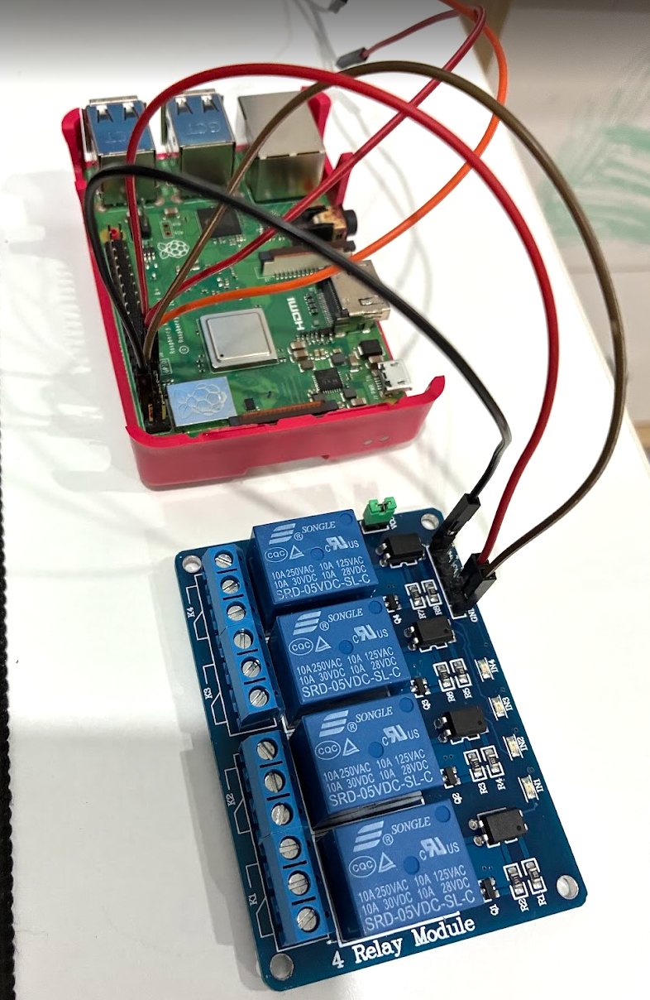
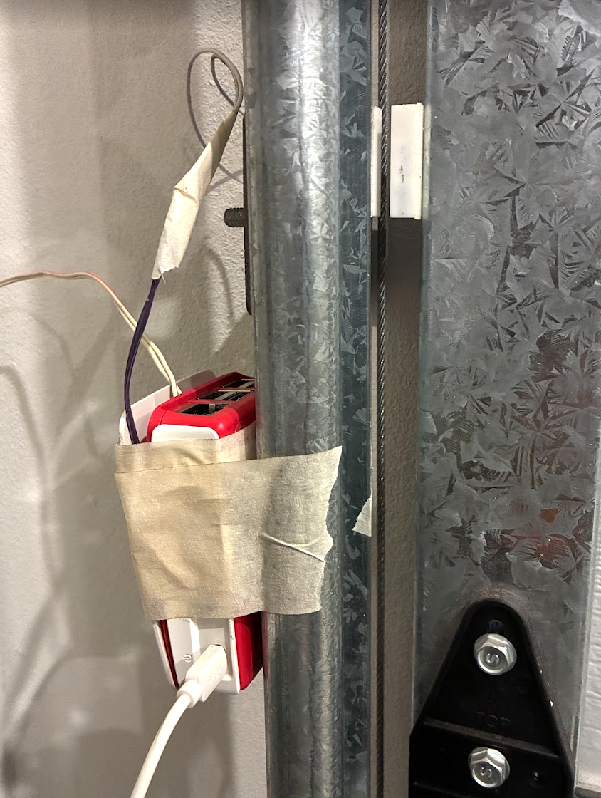
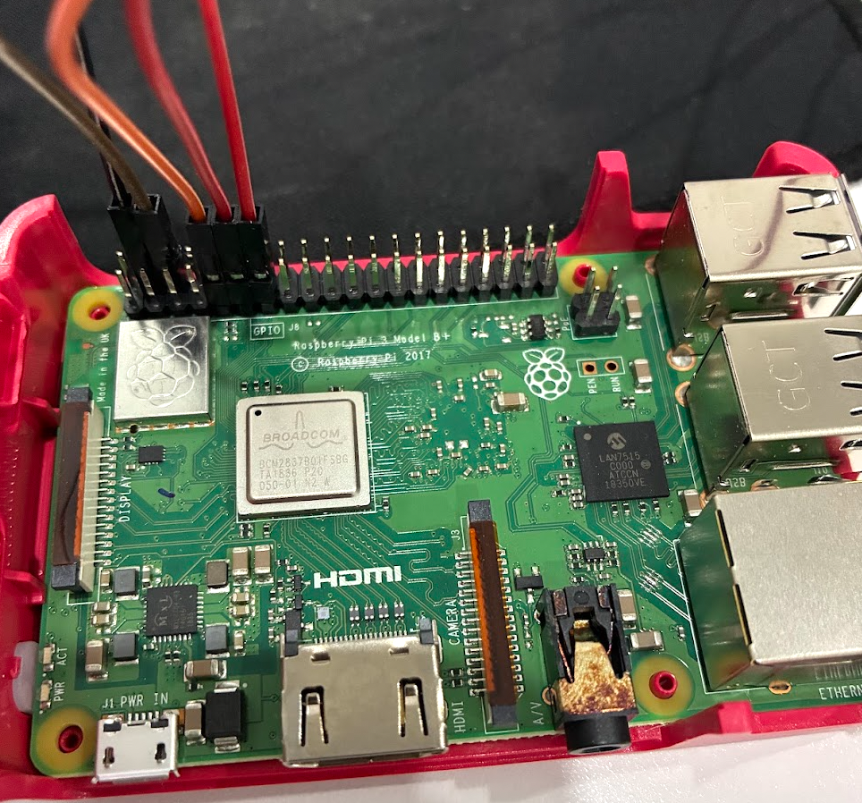
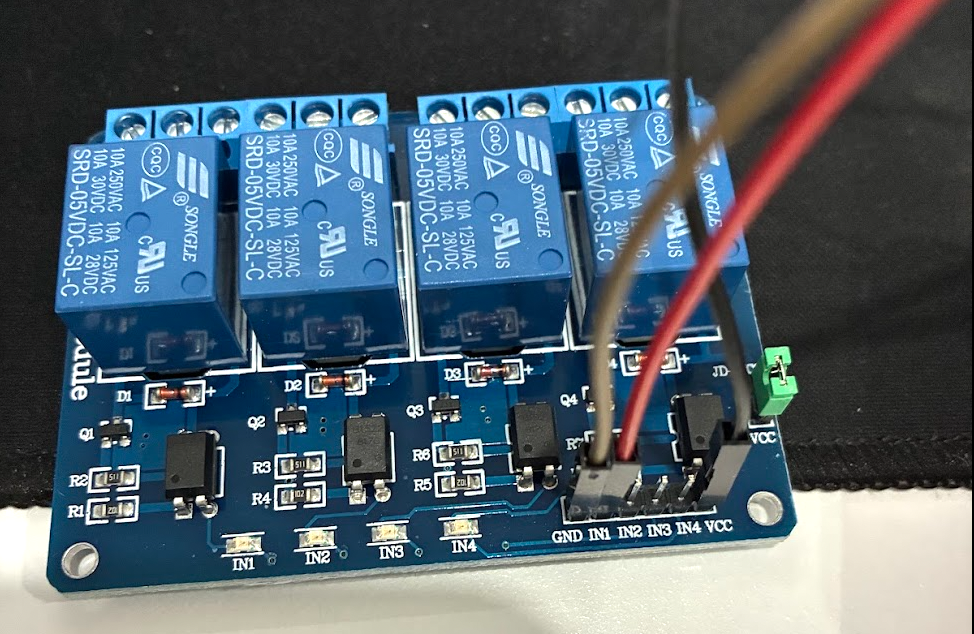
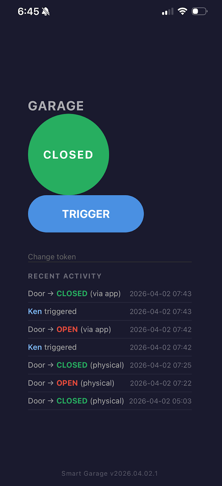
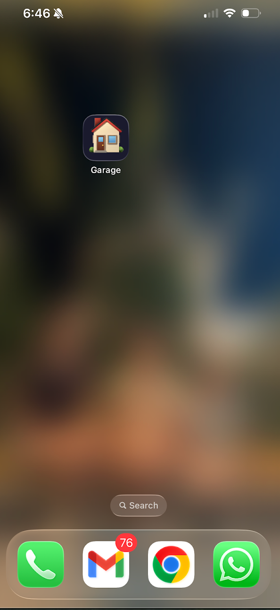

# Building a Reliable Smart Garage Monitor with a Raspberry Pi, FastAPI, and ntfy

*How I added remote monitoring and control to a dumb garage door — and why GPIO interrupts nearly derailed the whole thing.*

---

## The Problem

I kept leaving the garage door open. Not always wide open — sometimes just that "did I close it?" uncertainty that made me drive back home to check. What I wanted was simple: know the door's state from my phone, get a notification if I forgot to close it, and be able to trigger it remotely.

Commercial smart garage kits exist, but most require a cloud subscription, a proprietary hub, or a specific brand of opener. I had a Raspberry Pi sitting around, a spare afternoon, and a working garage door. That turned out to be enough.

---

## Parts List

| Part | Notes |
|---|---|
| Raspberry Pi 3 Model B+ (or any Pi with GPIO) | Any Pi with GPIO header works |
| Magnetic reed switch (NO type) | Wired between GPIO 17 and GND |
| 5V 4-channel relay module | Uses one channel to control the door opener |
| Jumper wires | |
| Double-sided tape or adhesive mount | To mount Pi near door opener |

Total cost (excluding the Pi): under $10.

---

## How the Hardware Works


*Raspberry Pi 3 Model B+ in its case, connected to the 4-channel relay module via jumper wires.*

The garage door opener already has a wall button — it's just a momentary switch that shorts two terminals together. The relay module plugs in parallel with that button. When the relay closes for half a second, the opener sees it as a button press. No soldering into the opener's internals required.

The reed switch is the sensor. It's a magnetically-operated switch: when the two halves (one on the door frame, one on the door itself) are close together (door closed), the circuit is closed. When the door opens, they separate and the circuit opens.


*The Pi installed on the garage wall next to the door track, with wires running to the reed switch and relay.*

### GPIO Pin Assignment

- **GPIO 17 (input)**: Reads the reed switch. Configured with a pull-up resistor (`PUD_UP`) so the pin is HIGH when floating (door open) and LOW when the switch closes (door closed). This means the sensor only needs to be wired between the pin and GND — no external resistor needed.
- **GPIO 27 (output)**: Controls the relay. Configured active LOW — the relay triggers when we pull the pin to GND, and idles HIGH.

```
Raspberry Pi                Reed Switch
GPIO 17 (PUD_UP) ─────────[SW]───── GND

GPIO 27 ──────────────── Relay IN1
GND  ─────────────────── Relay GND
3.3V ─────────────────── Relay VCC

Relay COM/NO ───── Garage opener wall button terminals
```


*Jumper wires on the GPIO header. The black connector spans from pin 1 toward the board edge.*


*The 4-channel relay module. Only IN1 is used; GND, VCC, and IN1 connect to the Pi.*

---

## Software Architecture

The software is a FastAPI app with two background workers running under the same lifespan context:

```
┌─────────────────────────────────────────────────────┐
│                    FastAPI App                      │
│                                                     │
│  ┌──────────────────┐    ┌───────────────────────┐  │
│  │  GPIO Poll Thread│    │  monitor_door() task  │  │
│  │  (daemon thread) │    │  (asyncio task)       │  │
│  │                  │    │                       │  │
│  │  Polls pin 17    │    │  Handles "open for    │  │
│  │  every 50ms with │    │  N minutes" repeating │  │
│  │  500ms debounce  │    │  alerts               │  │
│  │                  │    │                       │  │
│  │  → _on_state_    │    │                       │  │
│  │    change()      │    │                       │  │
│  └──────────────────┘    └───────────────────────┘  │
│           │                          │               │
│           └──────────┬───────────────┘               │
│                      ▼                               │
│              SQLite (events)                         │
│              ntfy.sh (push notifications)            │
└─────────────────────────────────────────────────────┘
```

The two workers are registered cleanly using FastAPI's `@asynccontextmanager` lifespan:

```python
@asynccontextmanager
async def lifespan(app):
    import asyncio
    from src.monitor import monitor_door
    if not MOCK:
        _setup_gpio_sensor()         # starts GPIO poll daemon thread
    tasks = [
        asyncio.create_task(
            monitor_door(
                read_door_state, notify, _log_event,
                lambda: _trigger_time["at"],
                interval_seconds=1, alert_minutes=DOOR_OPEN_ALERT_MINUTES, mock=MOCK,
                detect_changes=MOCK,
                get_opened_at_fn=lambda: _door_state["opened_at"],
            )
        )
    ]
    yield                            # app runs here
    for t in tasks:
        t.cancel()
    if not MOCK:
        GPIO.cleanup()
```

This means there's no `startup` event, no global thread reference to manage — everything is scoped to the lifespan context and cleaned up automatically when the app shuts down.

---

## Why GPIO.add_event_detect Failed

The natural approach for edge detection on a Pi is `GPIO.add_event_detect()`. You register a callback, and the library calls it whenever the pin transitions. I tried this first. It didn't work.

On this Pi OS version, `add_event_detect` silently fails to fire on the rising edge at startup — or fires spuriously, or misses transitions under load. This is a known issue in certain combinations of RPi.GPIO and kernel versions. It's frustrating because the failure mode is silent: the callback simply never fires.

The fix is a polling thread with software debounce:

```python
def _gpio_poll_thread():
    """Poll GPIO 17 every 50ms with 500ms debounce. Replaces add_event_detect."""
    import time as _time
    DEBOUNCE_STABLE = 10  # consecutive reads needed (~500ms at 50ms each)
    GPIO.setup(17, GPIO.IN, pull_up_down=GPIO.PUD_UP)
    raw_init = GPIO.input(17)
    last_confirmed = "open" if raw_init == GPIO.HIGH else "closed"
    candidate = last_confirmed
    count = 0
    while True:
        _time.sleep(0.05)
        raw = GPIO.input(17)
        state = "open" if raw == GPIO.HIGH else "closed"
        if state == candidate:
            count += 1
        else:
            candidate = state
            count = 1
        if count == DEBOUNCE_STABLE and candidate != last_confirmed:
            last_confirmed = candidate
            _on_state_change(last_confirmed)
```

The logic: poll every 50ms, require 10 consecutive stable reads before confirming a state change. That's a 500ms debounce window — long enough to ignore contact bounce from the reed switch, short enough to feel instant to a human. The thread runs as a daemon so it dies with the main process automatically.

This approach is more verbose than `add_event_detect`, but it's also more transparent: you can see exactly what it's doing, add logging anywhere, and tune the debounce window by changing a single integer.

---

## Knowing Who Moved the Door: App vs. Physical

A critical piece of the notification logic is attributing *why* the door moved. If I tap the button in the app, I don't need a notification telling me the door opened — I already know. But if the door opens on its own (a family member, a delivery driver who has the code, or a problem), I want to know immediately.

The solution is a simple heuristic: any state change within 20 seconds of an app-triggered relay pulse is classified as `"app"`. Everything else is `"physical"`.

```python
def _on_state_change(state: str):
    last_trigger = _trigger_time["at"]
    is_physical = (
        last_trigger is None
        or (datetime.utcnow() - last_trigger).total_seconds() > 20
    )
    source = "physical" if is_physical else "app"
    _log_event(source, "state_change", state)
    if is_physical:
        notify(f"Garage door {state.upper()} (physical trigger)")
```

Only `"physical"` changes trigger a push notification. The 20-second window was chosen because the door takes about 10–15 seconds to fully open or close after the relay fires — with a few seconds of margin.

Every event (trigger or state change) is written to SQLite with this attribution, so the activity log in the UI shows exactly who did what and when.

---

## Push Notifications with ntfy.sh

Notifications go through [ntfy.sh](https://ntfy.sh) — a free, open-source push notification service. It requires no account on the client side: you subscribe to a topic (a random string you choose), and any HTTP POST to `https://ntfy.sh/<your-topic>` sends a push to all subscribed phones.

```python
def notify(message: str):
    if TEST:
        logger.info(f"[TEST] would notify: {message}")
        return
    try:
        requests.post(f"https://ntfy.sh/{NTFY_TOPIC}", data=message, timeout=5)
    except Exception as e:
        logger.error(f"ntfy notification failed: {e}")
```

That's the entire notification implementation — a single `requests.post` call. The topic name is a secret (stored in `.env`) so only people who know it can subscribe. For higher security, ntfy supports access tokens and self-hosting, but the default setup is fine for personal use.

The monitor task handles the "door left open" repeating alert: if the door stays open for more than N minutes (default 10, configurable via `DOOR_OPEN_ALERT_MINUTES`), it sends a notification — and keeps sending one every N minutes until the door closes.

---

## The Zero-Build PWA

The frontend is a single `index.html` file — no npm, no build step, no framework. It polls `/api/status` every 5 seconds and shows the current door state and a 20-entry activity log.


*The PWA running on iPhone. The activity log shows who triggered the door and whether each state change was via the app or physical.*

A service worker is registered for PWA installability (so it shows the "Add to Home Screen" prompt on mobile), but it doesn't cache aggressively — there's no point caching a status page that needs to be fresh.

Auth tokens are stored in `localStorage`. First visit shows a login screen; once entered, the token persists.


*Installed as a PWA on the iPhone home screen — it opens full-screen with no browser chrome.*

The choice to avoid a build step was deliberate. A Pi running a home automation app doesn't need a frontend build pipeline. The 300-line vanilla JS file is readable, editable directly on the Pi, and has zero dependencies to keep updated.

---

## Local Development Without Hardware

The app has a `MOCK=true` mode for development on any machine without a Pi or garage. In mock mode:

- GPIO is never imported
- Door state is stored in an in-memory dict
- A background task randomly flips the door open/closed every 1–3 minutes (simulating physical events)
- The relay "trigger" schedules a state flip after 7 seconds (simulating the door actually moving)

```bash
# Set up and run locally
cp .env.example .env      # set MOCK=true, fill in API_TOKEN
source venv/bin/activate
python3 -m uvicorn src.api:app --reload
```

There's also a `TEST=true` mode for testing on real hardware without spamming your phone: it logs `[TEST] would notify: ...` instead of posting to ntfy.

---

## Deployment

Deployment is a single script:

```bash
bash deploy/setup.sh
```

It creates a Python venv, installs dependencies, writes a systemd unit file, and enables the service to auto-start on boot. After that:

```bash
sudo systemctl restart smart-garage
sudo journalctl -u smart-garage -f     # tail logs
```

The app is accessible at `http://<hostname>.local:8000` from any device on the local network. No port forwarding or dynamic DNS needed — this is a home network tool.

---

## Lessons Learned

**1. Don't trust GPIO.add_event_detect blindly.**
The RPi.GPIO documentation makes edge detection look simple. In practice, reliability varies with OS version and kernel configuration. If your callbacks aren't firing, polling is not a step backward — it's a pragmatic alternative with explicit, debuggable behavior.

**2. Software debounce is worth the extra code.**
Reed switches bounce. Without debouncing, a single door movement generates dozens of state-change events. The 10-read / 500ms debounce eliminates all of that with one integer.

**3. Notification fatigue kills usefulness.**
The app-vs-physical heuristic was an early addition after realizing that receiving a notification every time I pressed the button in the app was annoying enough to make me disable notifications entirely. Filtering those out made the remaining notifications actually meaningful.

**4. A daemon thread + asyncio task is a workable hybrid.**
Mixing a blocking poll thread with an asyncio event loop isn't idiomatic Python, but FastAPI's lifespan context makes it clean. The thread runs independently; the asyncio task handles the time-based alert logic. They share state through plain Python dicts, which is safe because only the GPIO thread writes `_door_state` and only the monitor task reads it.

**5. SQLite is sufficient.**
The event log gets a few dozen rows per day. SQLite handles this with zero configuration and zero maintenance. There's no need for a Postgres instance for a single-user home automation tool.

---

## What I'd Do Differently

- **Add a camera.** A snapshot of the door attached to the "door opened physically" notification would add a lot of value for security use cases.
- **HTTPS / Tailscale.** Currently accessible only on the local network. Adding Tailscale would give remote access without opening ports.
- **ntfy access tokens.** Right now the topic name is the only secret. ntfy supports proper access control — worth adding for shared households.

---

## GitHub

Full source code: **https://github.com/kenigma/smart-garage**

Pull requests and issues welcome.

---

*Built with: Python 3.11, FastAPI, RPi.GPIO, SQLite, ntfy.sh*
